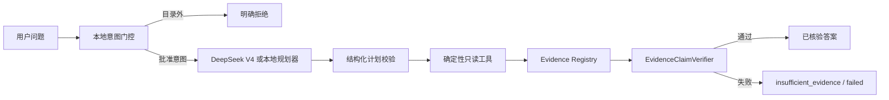

# FitzSight v0.13.0 架构

## 三层分权

1. **规划层**：DeepSeek V4 Flash/Pro 只产生 JSON 高层计划；默认可使用完全离线的 `ConstrainedRulePlanner`。
2. **工具层**：只读 SQL、统计检验、贡献分解、异常检测与文档证据检索产生全部关键数字。
3. **验证层**：Evidence Registry 保存来源，EvidenceClaimVerifier 验证证据覆盖、禁止内容和因果边界。

## 任务闭环

问题 → 意图门控 → 计划 → 动作执行 → 证据登记 → 结论核验 → 支持/假设/拒绝。任何工具失败、字段缺失、证据不足或越界请求均进入显式失败路径。

## 数据与权限

- 比赛版本使用固定种子的合成金融运营数据。
- 数据库查询为只读且经过 SQL 安全检查。
- 模型不获得数据库连接、SQL 生成、资金操作或客户操作权限。
- 生产 RBAC、脱敏、留存与审计集成属于后续部署蓝图，不作为当前 PoC 已实现能力。
